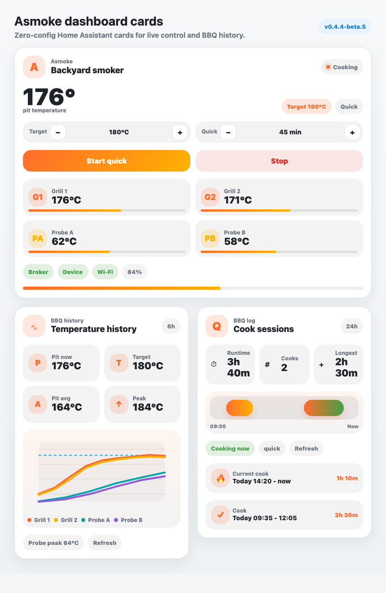

# Asmoke Dashboard Cards

The integration includes custom Lovelace cards for a compact Asmoke dashboard.
They are designed to feel close to current Home Assistant tile dashboards:
rounded tiles, clear status chips, BBQ-inspired history visuals, light and dark
theme support, and no extra frontend dependency.



The screenshot uses sample values, but it shows the intended layout: one live
control card, one temperature history card, and one cook session card.

## Quick start

For a single configured Asmoke smoker, start with the card picker or this YAML:

```yaml
type: custom:asmoke-smoker-card
```

Add the optional history cards below it:

```yaml
- type: custom:asmoke-smoker-history-card
  hours_to_show: 6

- type: custom:asmoke-smoker-session-card
  hours_to_show: 24
```

You only need to configure `device_id`, `climate`, or individual entities when
Home Assistant cannot infer the smoker or when you have multiple Asmoke smokers.

## Cards

### Asmoke Smoker Card

```yaml
type: custom:asmoke-smoker-card
```

Shows live pit control, Quick target time, start/stop buttons, grill and probe
temperature tiles, broker/device/Wi-Fi status, battery, and last result.

Optional stale/offline display behavior:

```yaml
type: custom:asmoke-smoker-card
hide_offline_data: true
offline_hide_after: 600
hide_disconnected_probes: true
```

By default, `hide_offline_data` is `false`, so the card keeps showing the normal
Home Assistant entity states. When enabled, the live card keeps the last values
it saw while the dashboard is open and the smoker is only briefly offline. After
`offline_hide_after` seconds with `Broker connected` off, `Device online` off,
or the pit thermostat unavailable, the live value sections become invisible
while the card keeps its layout and the header still shows the offline status.
Set `offline_hide_after: 0` to hide live values immediately when the offline
state is detected.

By default, `hide_disconnected_probes` is `false`, so Probe A and Probe B keep
their tiles and show `--` when a probe is not plugged in. Enable
`hide_disconnected_probes` to remove unavailable probe tiles from the live card
while leaving Grill 1 and Grill 2 visible.

### Asmoke Temperature History

```yaml
type: custom:asmoke-smoker-history-card
hours_to_show: 6
```

Shows a BBQ-style temperature chart for Grill 1, Grill 2, Probe A, and Probe B.
It also shows pit average, peak temperature, probe peak, current target, and a
manual refresh chip.

### Asmoke Cook Sessions

```yaml
type: custom:asmoke-smoker-session-card
hours_to_show: 24
```

Shows historical cook runtime from `binary_sensor...cook_active`, including a
timeline, total runtime, cook count, longest cook, current/idle state, and the
latest sessions.

## How entity selection works

The cards try to make the dashboard setup as simple as possible.

Selection order:

1. If you set explicit entity overrides, those always win.
2. If you set `device_id`, the cards use entities from that Home Assistant device.
3. If you set `climate`, the cards use the climate entity and then resolve related entities from the same Home Assistant device.
4. If there is exactly one Asmoke pit thermostat, the cards select it automatically.
5. If device registry data is unavailable, the cards fall back to the entity prefix.

This means renamed entities should keep working as long as Home Assistant still
exposes them on the same device.

## Loading the cards

After installing or updating the integration, restart Home Assistant. The
integration serves the card at:

```text
/asmoke_cloud/frontend/asmoke-smoker-card.js
```

The integration also tries to register this JavaScript module with the Home
Assistant frontend automatically. If Home Assistant was already open in your
browser or mobile app, refresh the page or fully close and reopen the app.

If the cards do not appear in the card picker, add the module manually as a dashboard
resource:

1. Open `Settings -> Dashboards`.
2. Open the three-dot menu and choose `Resources`.
3. Add this resource:

```yaml
url: /asmoke_cloud/frontend/asmoke-smoker-card.js
type: module
```

## Minimal dashboard YAML

```yaml
- type: custom:asmoke-smoker-card

- type: custom:asmoke-smoker-history-card
  hours_to_show: 6

- type: custom:asmoke-smoker-session-card
  hours_to_show: 24
```

In most installs this is enough. If Home Assistant has exactly one Asmoke pit
thermostat, the cards select it automatically.

When `climate` is configured, or when the card can infer one automatically, the
related entities are resolved in this order:

1. explicit entity overrides in the card YAML;
2. entities on the same Home Assistant device when the frontend exposes device
   registry data;
3. the climate entity prefix.

For prefix fallback, this means:

```text
climate.asmoke_backyard_pit_thermostat -> asmoke_backyard
```

For multiple smokers or fully renamed entities, select the Home Assistant device
or climate entity:

```yaml
type: custom:asmoke-smoker-card
device_id: 9f2a1a6d7c8e4b1f8c0d123456789abc
```

```yaml
type: custom:asmoke-smoker-card
climate: climate.asmoke_backyard_pit_thermostat
```

The same `device_id` or `climate` option can be used on the history and session
cards.

## Optional overrides

Use overrides on any of the three cards if Home Assistant renamed one of your
entities or if you want a different title.

```yaml
type: custom:asmoke-smoker-card
name: Backyard smoker
climate: climate.asmoke_backyard_pit_thermostat
quick_time: number.asmoke_backyard_quick_target_time
start_quick: button.asmoke_backyard_start_quick_cook
stop: button.asmoke_backyard_stop_cook
cook_active: binary_sensor.asmoke_backyard_cook_active
device_online: binary_sensor.asmoke_backyard_device_online
broker_connected: binary_sensor.asmoke_backyard_broker_connected
```

Advanced entity overrides are also supported:

```yaml
grill_temp_1: sensor.asmoke_backyard_grill_temperature_1
grill_temp_2: sensor.asmoke_backyard_grill_temperature_2
probe_a_temp: sensor.asmoke_backyard_probe_a_temperature
probe_b_temp: sensor.asmoke_backyard_probe_b_temperature
battery: sensor.asmoke_backyard_battery_level
target_time: sensor.asmoke_backyard_target_time
mode: sensor.asmoke_backyard_mode
wifi_connected: binary_sensor.asmoke_backyard_wi_fi_connected
last_result: sensor.asmoke_backyard_last_result_message
```

History-specific options:

```yaml
hours_to_show: 12
refresh_interval: 300
min_temp: 0
max_temp: 300
```

`refresh_interval` is in seconds. The history cards use Home Assistant recorder
history, so their data depends on the recorder retention and includes only data
that Home Assistant has already stored.

## Troubleshooting

If a card says it cannot select a smoker automatically:

1. Open the card editor.
2. Select `Asmoke device`, or select the `Pit thermostat` climate entity.
3. Refresh the dashboard after saving.

If history cards stay empty, check that the Home Assistant `recorder`
integration is enabled and that the smoker entities have produced data within
the selected `hours_to_show` window.

## Card picker

Once the module is loaded, Home Assistant can show these cards in the custom
card picker:

- `Asmoke Smoker Card`
- `Asmoke Temperature History`
- `Asmoke Cook Sessions`

The built-in editors expose the most important fields. For advanced overrides,
use YAML mode.
